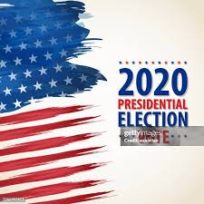
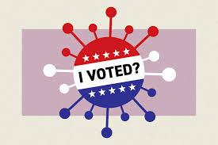

## **About the Project**

  
  
Image 1 Description

The 2020 election unfolded during the unprecedented COVID-19 pandemic, which profoundly affected voting behavior nationwide. In New York State, home to over 19.3 million residents, the pandemic had a dramatic impact. Over 1.5 million COVID-19 cases and more than 35,000 deaths were reported by the end of 2020, creating a public health crisis that discouraged in-person voting and shifted the focus toward absentee ballots. In the 2020 general election, New York saw a record 45% increase in absentee ballot usage compared to previous years, with more than 2 million absentee ballots cast out of a total 8.6 million votes.

Our team seeks to analyze how these extraordinary circumstances shaped voter turnout, voting methods, and participation trends across New York State. By integrating demographic data, COVID-19 statistics, and election results, we aim to uncover how New Yorkers adapted to these challenges and what it reveals about the resilience of democracy in the face of crisis. Explore our website to learn more about the intersection of public health and electoral processes during one of the most transformative elections in history. 

  
  
Poster Description

  
  
Image 2 Description

For more information about how COVID-19 shaped the 2020 election in New York State, check out these references and explore our findings：

## **References**

1. [Time Article on Election and COVID-19](https://time.com/5876599/election-2020-coronavirus/)
2. [Another Article on Election Impact](https://time.com/5876599/election-2020-coronavirus/)
3. [COVID-19 Data in New York State](https://coronavirus.health.ny.gov/covid-19-data-new-york)

